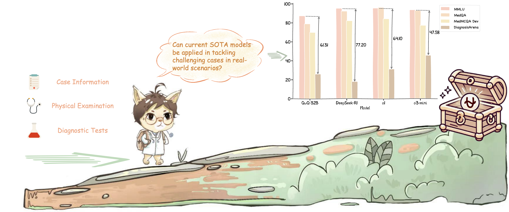
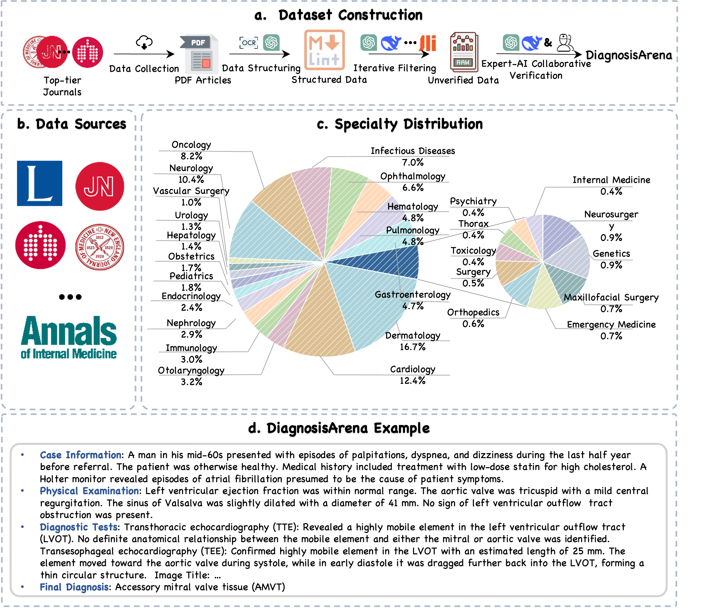

# DiagnosisArena: Benchmarking Diagnostic Reasoning for Large Language Models
<p align="center">        </p>


<p align="center">
  📄 <a href="https://arxiv.org/abs/2505.14107" target="_blank">Paper</a> &nbsp; | &nbsp;
  🤗 <a href="https://huggingface.co/datasets/SII-SPIRAL-MED/DiagnosisArena" target="_blank">Hugging Face</a> &nbsp; | &nbsp;
  📘 <a href="https://mp.weixin.qq.com/s/8uRDnWzT2I9IRq7djuvEqw" target="_blank">量子位</a> &nbsp; | &nbsp;
</p>


## 🔥News

- [2026/04/05] Our work **[DiagnosisArena](https://aclanthology.org/2026.findings-acl.151/)** is accepted to **ACL 2026 Findings**!
- [2025/06/04] Our work is featured by [量子位](https://mp.weixin.qq.com/s/8uRDnWzT2I9IRq7djuvEqw) on WeChat!

  
## Contents

- [Introduction](#introduction)
- [How to use?](#how-to-use)
  - [Load Data](#load-data)
  - [Inference](#inference)
  - [Evaluation](#evaluation)
  - [Multi-Choice Question Evaluation](#multi-choice-question-evaluation)
- [Contact Us](#contact-us)
- [Citation](#citation)
- [Disclaimer and Terms of Use](#disclaimer-and-terms-of-use)

## Introduction

<p align="center">        </p>

**DiagnosisArena** is a comprehensive and challenging medical benchmark designed to assess the diagnostic reasoning abilities of LLMs in clinical settings. Through a meticulous construction pipeline, **DiagnosisArena** consists of 1,113 pairs of structured patient cases and corresponding diagnoses, spanning 28 medical specialties, deriving from clinical case reports published in 10 high-impact medical journals. The experimental results indicate that even the SOTA reasoning models perform relatively poorly on **DiagnosisArena**. Through **DiagnosisArena**, we aim to drive further advancements in AI’s diagnostic reasoning capabilities, enabling more effective solutions for real-world clinical diagnostic challenges.

## How to use?

### Load Data

We have released the data of the test set on [Hugging Face](https://huggingface.co/datasets/SII-SPIRAL-MED/DiagnosisArena). In the test split, it contains 915 instances, including the answers for small-scale testing.

Loading the data is very simple. You can use the following code snippet:

```python
from datasets import load_dataset

# Load the dataset for the test split
dataset=load_dataset("SII-SPIRAL-MED/DiagnosisArena", split="test")

print(dataset[0])
```

Each data entry contains the following fields:

- `id`: The unique identifier for each problem.
- `Case Information`: The basic information about the patient, including demographic details and clinical history.
- `Physical Examination`: The objective anatomic findings through the use of observation, palpation, percussion, and auscultation.
- `Diagnostic Tests`: These include various exams that the patient undergoes, such as laboratory tests (e.g., blood and urine tests), imaging tests (e.g., mammography and CT scans), genetic tests, and more.
- `Final Diagnosis`: The definitive name of the patient's condition, expressed in a single term.
- `Options`: Four choices regarding the patient's condition.
- `Right Option`: The correct choice based on clinical evidence and guidelines.

### Inference

Scripts are organized into two subfolders under `code/`:

```
code/
  open/         # Open-ended diagnosis evaluation
    inference.py
    evaluation.py
    metric.py
    run.sh
  mcq/          # Multiple-choice question evaluation
    inference_mcq.py
    metric_mcq.py
    run_mcq.sh
```

The quickest way to run the full pipeline is via the provided shell scripts. Fill in your model and API details in the config block at the top of the script, then run:

```bash
bash code/open/run.sh       # open-ended pipeline
bash code/mcq/run_mcq.sh    # MCQ pipeline
```

Alternatively, run each step manually. `--input_path` accepts either a HuggingFace dataset repo ID or a local `.jsonl` file path:

```bash
python code/open/inference.py \
    --input_path SII-SPIRAL-MED/DiagnosisArena \
    --output_root ./results \
    --model_name gpt-4o \
    --api_key YOUR_API_KEY \
    --base_url YOUR_BASE_URL \
    --folk_nums 16
```

### Evaluation

You need to provide a model to serve as the evaluation judge. The output file is automatically named `{input_filename}_{judge_model}_evaled.jsonl` alongside the inference output.

```bash
python code/open/evaluation.py \
    --input_path ./results/gpt-4o_answer.jsonl \
    --judge_model gpt-4o \
    --api_key YOUR_API_KEY \
    --base_url YOUR_BASE_URL \
    --folk_nums 16
```

After the evaluation, run the following to obtain the detailed Top-k metric results:

```bash
python code/open/metric.py \
    --model_name gpt-4o \
    --metric_path ./results/gpt-4o_answer_gpt-4o_evaled.jsonl
```

### Multi-Choice Question Evaluation

If you would like to evaluate the DiagnosisArenaMCQ dataset, the process is similar to the one described above.

First, run the inference script:
```bash
python code/mcq/inference_mcq.py \
    --input_path SII-SPIRAL-MED/DiagnosisArena \
    --output_root ./results \
    --model_name gpt-4o \
    --api_key YOUR_API_KEY \
    --base_url YOUR_BASE_URL \
    --folk_nums 16
```

Next, run the metric evaluation script:
```bash
python code/mcq/metric_mcq.py \
    --model_name gpt-4o \
    --metric_path ./results/gpt-4o_answer.jsonl
```

## Contact Us

If you are interested in our project and would like to join us, feel free to send an email to [xiaofan.zhang@sjtu.edu.cn](mailto:xiaofan.zhang@sjtu.edu.cn).

## Citation

If you do find our code helpful or use our benchmark dataset, please cite our paper.

```
@inproceedings{zhu-etal-2026-diagnosisarena,
    title = "{D}iagnosis{A}rena: Benchmarking Diagnostic Reasoning for Large Language Models",
    author = "Zhu, Yakun  and
      Huang, Zhongzhen  and
      Mu, Linjie  and
      Huang, Yutong  and
      Nie, Wei  and
      Liu, Jiaji  and
      Zhang, Shaoting  and
      Liu, Pengfei  and
      Zhang, Xiaofan",
    editor = "Liakata, Maria  and
      Moreira, Viviane P.  and
      Zhang, Jiajun  and
      Jurgens, David",
    booktitle = "Findings of the {A}ssociation for {C}omputational {L}inguistics: {ACL} 2026",
    month = jul,
    year = "2026",
    address = "San Diego, California, United States",
    publisher = "Association for Computational Linguistics",
    url = "https://aclanthology.org/2026.findings-acl.151/",
    pages = "3074--3098",
    ISBN = "979-8-89176-395-1"
}
```

## Disclaimer and Terms of Use

The Hugging Face dataset contains 915 entries due to temporal and copyright considerations.
First, we excluded 2025 data as it is incomplete and may introduce outliers.
Second, certain journals and papers are subject to copyright restrictions and were withheld from public release for compliance reasons.
This resulted in the final dataset of 915 entries.

This dataset is adapted from publicly available literature, including publications from Cell, JAMA, and similar sources. All case data has been de-identified. **This dataset is provided for research and model evaluation purposes only. It must not be used for clinical decision-making or medical diagnosis.**

