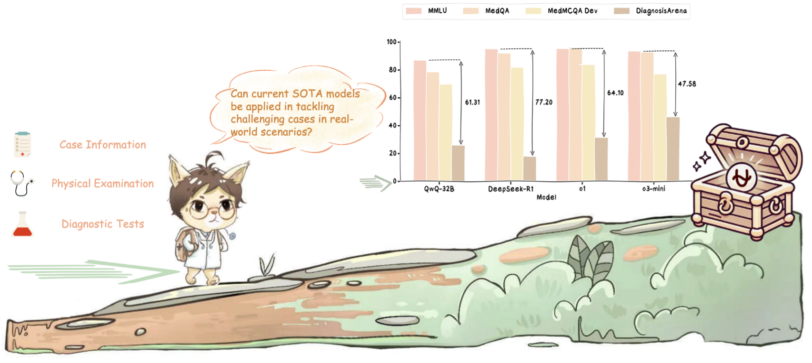
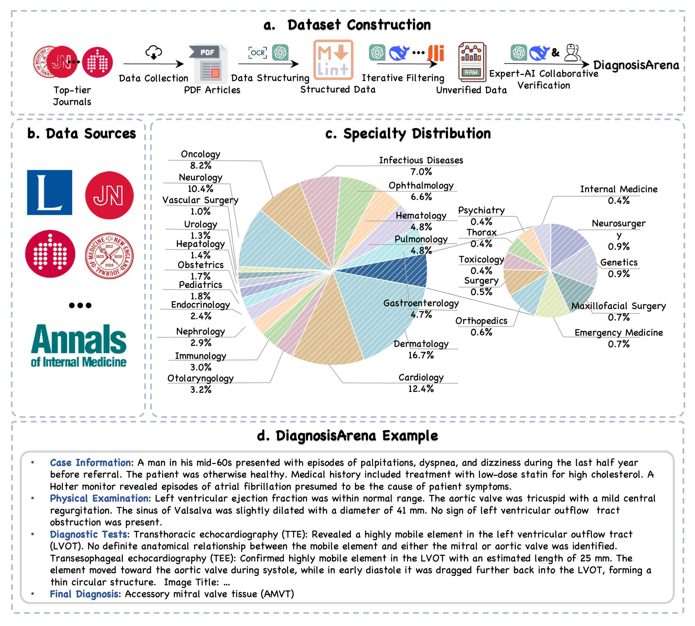

# DiagnosisArena: Benchmarking Diagnositic Reasoning for Large language Models
<p align="center">        </p>


<p align="center">
  📄 <a href="https://arxiv.org/abs/2505.14107" target="_blank">Paper</a> &nbsp; | &nbsp;
  🤗 <a href="https://huggingface.co/datasets/shzyk/DiagnosisArena" target="_blank">Hugging Face</a>
</p>


## Contents

- [Introduction](#introduction)
- [How to use?](#how-to-use)
  - [Load Data](#load-data)
  - [Inference](#inference)
  - [Evaluation](#evaluation)

- [Citation](#citation)

## Introduction

<p align="center">        </p>

**CaseProArena** is a comprehensive and challenging medical benchmark designed to assess the diagnostic reasoning abilities of LLMs in clinical settings. Through a meticulous construction pipeline, **CaseProArena** consists of 1, 113 pairs of structured patient cases and corresponding diagnoses, spanning 28 medical specialties, deriving from clinical case reports published in 10 high-impact medical journals. The experimental results indicate that even the SOTA reasoning models perform relatively poorly on **CaseProArena**. Through **CaseProArena**, we aim to drive further advancements in AI’s diagnostic reasoning capabilities, enabling more effective solutions for real-world clinical diagnostic challenges.

## How to use?

### Load Data

We have released the data of the test set on [Hugging Face](https://huggingface.co/datasets/shzyk/DiagnosisArena). In the test split, it contains 1,000 instance including the answers for small-scale testing.

Loading the data is very simple. You can use the following code snippet:

```python
from datasets import load_dataset

# Load the dataset for the test split
dataset=load_dataset("shzyk/DiagnosisArena", split="test")

print(dataset[0])
```

Each data entry contains the following fields:

- `id`: The unique identifier for each problem.
- `Case Information`: The basic information about the patient, including demographic details and clinical history.
- `Physical Examination`: The objective anatomic findings through the use of observation, palpation, percussion, and auscultation.
- `Diagnostic Tests`: These include various exams that the patient undergoes, such as laboratory tests (e.g., blood and urine tests), imaging tests (e.g., mammography and CT scans), genetic tests, and more.
- `Final Diagnosis`: The definitive name of the patient's condition, expressed in a single term.
- `Options`: Four choices regarding the patient's condition.
- `Right Option`: The correct choice based on clinical evidence and guidelines.

### Inference

To perform inference, first navigate to the code directory:
```bash
cd code
```

Next, run the inference script using the following command:

```bash
python inference.py \
    --hf_data_path shzyk/DiagnosisArena \
    --model_name gpt-4o \
    --output_path ./model_answer.jsonl \
    --api_key YOUR_API_KEY \
    --base_url YOUR_BASE_URL \
    --folk_nums 16
```

### Evaluation

You need to provide a model to serve as the evaluation judger. Then, run the following code, which will evaluate the inference results (please make sure the path to your inference results is correctly specified):

```bash
python evaluation.py \
    --input_path ./results/model_answer.jsonl \
    --output_path ./results/model_answer_evaled.jsonl \
    --model_name gpt-4o \
    --api_key YOUR_API_KEY \
    --base_url YOUR_BASE_URL \
    --folk_nums 16
```
After the evaluation, you can run this code to obtain the detailed Top-k metric results.

```bash
python metric_results.py \
    --model_name gpt-4o \
    --metric_path ./results/model_answer_evaled.jsonl \
```

## Citation

If you do find our code helpful or use our benchmark dataset, please citing our paper.

```
@article{zhu2025diagnosisarena,
      title={DiagnosisArena: Benchmarking Diagnostic Reasoning for Large Language Models},
      author={Yakun Zhu and Zhongzhen Huang and Linjie Mu and Yutong Huang and Wei Nie and Shaoting Zhang and Pengfei Liu and Xiaofan Zhang},
      year={2025},
      journal={arXiv preprint arXiv:2505.14107},
      url={https://arxiv.org/abs/2505.14107}
}
```
